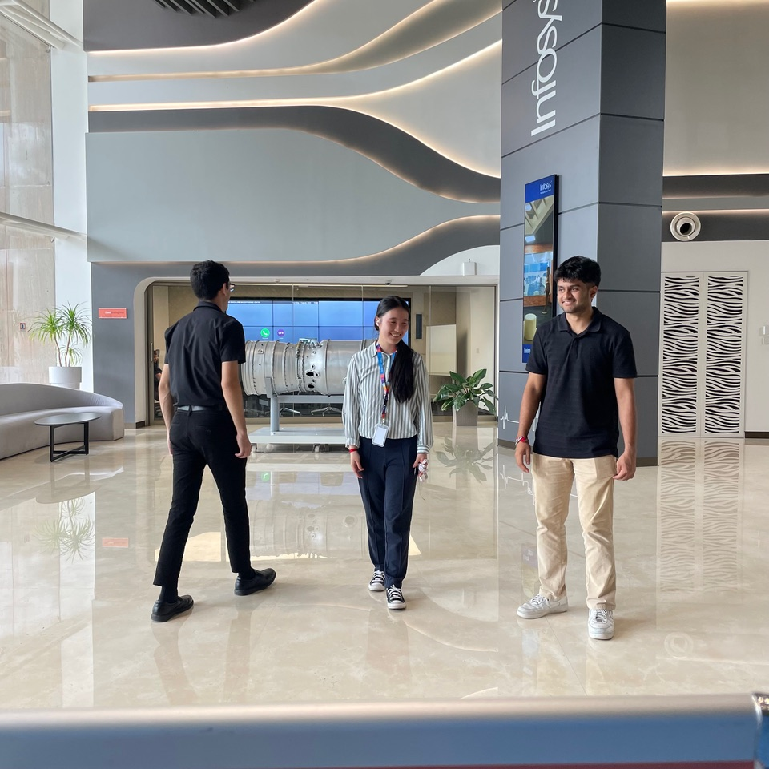
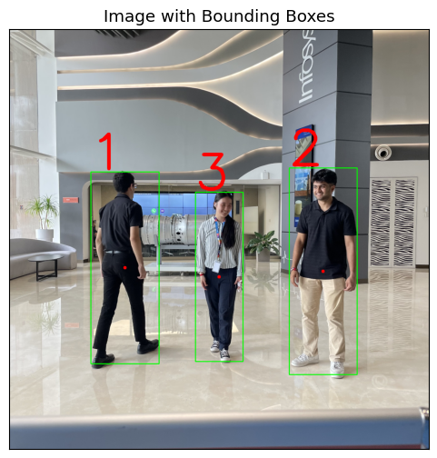
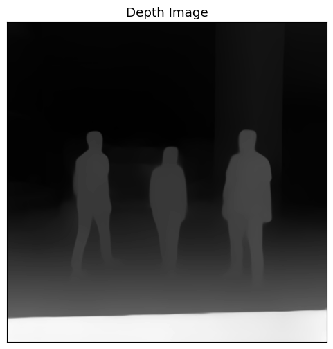
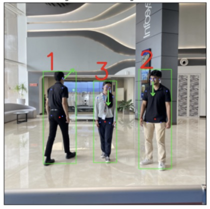
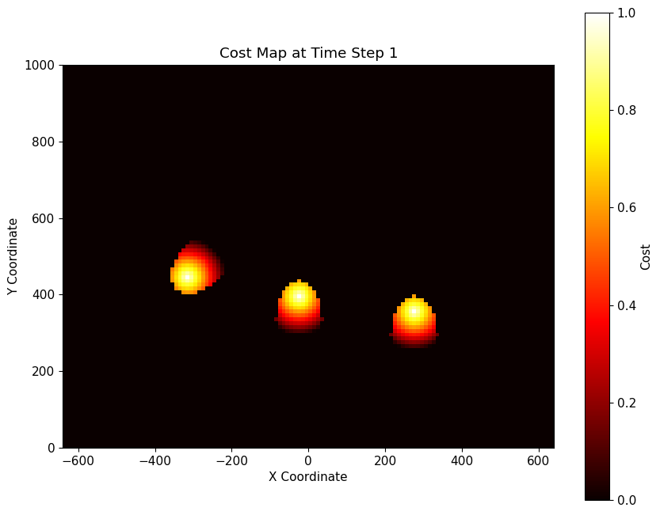
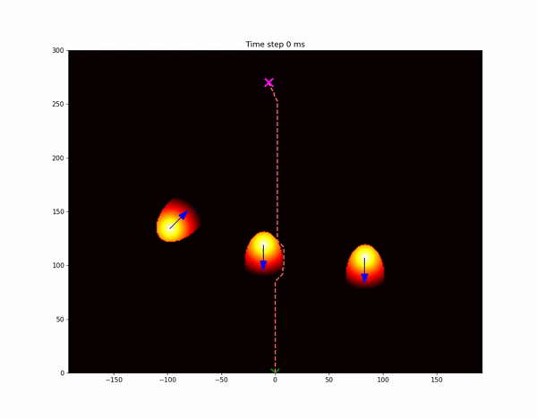

# Human-Aware Autonomous Navigation (HAAN) System

## Overview

The Human-Aware Autonomous Navigation (HAAN) System is a sophisticated framework designed to enable a robot to navigate safely and efficiently in dynamic environments populated by humans. The system uses a combination of computer vision, depth estimation, and probabilistic A* path planning to predict human movements and avoid collisions.

## Table of Contents

- [Key Features](#key-features)
- [Installation](#installation)
- [Directory Structure](#directory-structure)
- [Pipeline](#pipeline)
- [How to Run](#how-to-run)
- [Example Results](#example-results)
- [Requirements](#requirements)
- [Way Forward and Next Steps](#way-forward-and-next-steps)
- [Code Resources](#code-resources)
- [Acknowledgements](#acknowledgements)
- 
## Key Features

- **Real-time Path Planning**: Uses probabilistic A* algorithm for efficient and safe path planning in dynamic environments.
- **Human Detection and Tracking**: Utilizes YOLO for person detection and PoseNet for keypoint detection to predict human movements.
- **Depth Estimation**: Integrates depth estimation techniques to measure the distance of humans from the robot.
- **Direction and Speed Estimation**: Estimates the direction and speed of detected humans to predict their future positions.
- **Simulation Environment**: Includes a simulation module for testing and visualizing the robot's navigation in a dynamic environment.

## Installation

To set up the HAAN system, follow these steps:

1. **Clone the repository**:

    ```bash
    git clone https://github.com/prichard26/Human-Aware-Autonomous-Navigation-HAN-System.git
    ```

2. **Navigate to the project directory**:

    ```bash
    cd Human-Aware-Autonomous-Navigation-HAN-System
    ```

3. **Install the required dependencies**:

    ```bash
    pip install -r requirements.txt
    ```

## Directory Structure

The project has the following structure:

```plaintext
.
├── data/                            # Directory containing data files
├── images/                          # Directory containing images used in the project
├── model/                           # Directory containing model files
│   └── orientation_model.pkl        # Pre-trained orientation model
├── src/                             # Source code directory
│   ├── __init__.py                  # Init file for the src package
│   ├── calibration.py               # Calibration module for the camera system
│   ├── depth_estimation.py          # Module for depth estimation from images
│   ├── direction_speed.py           # Module for direction and speed estimation of detected persons
│   ├── draw_boxes.py                # Utility to draw bounding boxes around detected persons
│   ├── model_initialization.py      # Module to initialize and load the ML models
│   ├── simulation_a_star.py         # A* algorithm for path planning
│   ├── simulation_a_star_futur.py   # Extended A* algorithm for future enhancements
│   └── utils.py                     # Utility functions used across the project
├── testing/                         # Directory for testing files and scripts
├── main.ipynb                       # Main Jupyter notebook for running the system
├── CV_PROJECT.ipynb                 # Additional Jupyter notebook for computer vision tasks
├── LICENSE                          # License file
├── README.md                        # Project documentation
└── environment.yml                  # Conda environment configuration file
```
├── data/                            # Directory containing data files
├── images/                          # Directory containing images used in the project
├── model/                           # Directory containing model files
│   └── orientation_model.pkl        # Pre-trained orientation model
├── src/                             # Source code directory
│   ├── __init__.py                  # Init file for the src package
│   ├── calibration.py               # Calibration module for the camera system
│   ├── depth_estimation.py          # Module for depth estimation from images
│   ├── direction_speed.py           # Module for direction and speed estimation of detected persons
│   ├── draw_boxes.py                # Utility to draw bounding boxes around detected persons
│   ├── model_initialization.py      # Module to initialize and load the ML models
│   ├── simulation_a_star.py         # A* algorithm for path planning
│   ├── simulation_a_star_futur.py   # Extended A* algorithm for future enhancements
│   └── utils.py                     # Utility functions used across the project
├── testing/                         # Directory for testing files and scripts
├── main.ipynb                       # Main Jupyter notebook for running the system
├── CV_PROJECT.ipynb                 # Additional Jupyter notebook for computer vision tasks
├── LICENSE                          # License file
├── README.md                        # Project documentation
└── environment.yml                  # Conda environment configuration file
```
## Pipeline

The HAAN System follows a well-structured pipeline:

### 1. **Person Detection**
   - **Module**: `model_initialization.py`, `draw_boxes.py`
   - **Description**: Detects humans in the camera feed using YOLO and marks them with bounding boxes.

### 2. **Depth Estimation**
   - **Module**: `depth_estimation.py`
   - **Description**: Estimates the depth (distance) of each detected person from the robot using a pre-trained depth model.

### 3. **Direction and Speed Estimation**
   - **Module**: `direction_speed.py`
   - **Description**: Estimates the direction and speed of each detected person by analyzing their movement and orientation.

### 4. **Path Planning**
   - **Module**: `simulation_a_star.py`
   - **Description**: Computes the safest and most efficient path for the robot to navigate through the dynamic environment using a probabilistic A* algorithm.

### 5. **Simulation and Visualization**
   - **Module**: `main.ipynb`
   - **Description**: Simulates the robot's movement, displays the dynamic obstacles, and visualizes the planned path.

## How to Run

1. **Calibration**: 
   - Run `calibration.py` to calibrate your camera system.
   
2. **Person Detection and Depth, Direction, Speed Estimation**: 
   - Run the notebook `main.ipynb`. This notebook integrates all functions, including person detection, depth estimation, direction estimation, speed estimation, path planning, and visualization. Once you run this notebook, everything will work seamlessly.

3. **Path Planning and Simulation**: 
   - The `simulation_a_star.py` script, called within `main.ipynb`, runs the probabilistic A* algorithm and simulates the robot's movement.

4. **Visualization**: 
   - The visualization is also handled within `main.ipynb`, which calls the necessary functions from `utils.py` and other modules to display the robot's navigation, obstacles, and paths.
     
## Example Results

- **Image 1**: Initial Image
  
  

- **Image 2**: Person Detection with Bounding Boxes
  
  

- **Image 3**: Depth Estimation Results
  
  

- **Image 4**: Direction and Speed Estimation
  
  

- **Image 5**: Cost Map for Path Planning
  
  

- **GIF**: Robot Navigation through Dynamic Environment
  
  
  
## Requirements

- Python 3.8+
- OpenCV
- TensorFlow
- Matplotlib
- NumPy
- SciPy
  
### Way Forward and Next Steps

#### 1. Use a Depth Camera
- **Objective**: Integrate depth inputs into our inputs for accurate x position and y depth position.
- **Action Items**:
  - Implement depth calibration steps within the code.
  - Ensure depth position integration eliminates the need for manual calibration.

#### 2. Integrate Simulation with Real-Time Images
- **Objective**: Simulate camera readings with continuous data input into the simulation.
- **Action Items**:
  - Integrate A* with non-predictive obstacle positions and evaluate its pathfinding efficiency.
  - Explore the development of a speed algorithm:
    - Analyze videos by taking multi-frame inputs to predict speed (e.g., 20 screenshots every 2 seconds).
    - Use the central keypoint for plotting obstacle positions and tracking movements across videos to predict speed.

#### 3. Reduce Computation Time
- **Objective**: Optimize code execution to enhance simulation performance.
- **Action Items**:
  - Replace loops with NumPy operations.
  - Identify optimal simulation parameters (e.g., time between updates, scale factor).

### 4. Exploration of More Optimal Models for Direction and Pathfinding

#### Direction Models
- **Objective**: Train a model that predicts the direction the person (obstacle) is facing.
- **Action Items**:
  - Investigate models for angle prediction between 0 and 360 degrees.
  - Possible explorations: 
    - Multi-layer perceptron (MLP)
    - Decision Trees

#### Pathfinding Algorithms
- **Objective**: Explore enhancements to the A* algorithm and alternatives.
- **Action Items**:
  - **Option 1**: Modify the current A* algorithm to include time-based obstacle prediction.
  - **Option 2**: Investigate alternative heuristics beyond Euclidean distance (e.g., Chebyshev Distance).
  - **Option 3**: Compare and time different navigation algorithms, including D*, Dijkstra.

### Code Resources

- **Heuristics**: [Heuristics - Stanford](https://stanford.edu)
- **Posenet PyTorch**: 
  - [PyTorch port of Google TensorFlow.js PoseNet](https://github.com/rwightman/posenet-pytorch)
- **YOLOv5**: 
  - [YOLOv5 in PyTorch > ONNX > CoreML > TFLite](https://github.com/ultralytics/yolov5)

### Acknowledgements
- Thanks to Nahas, Yathisha, Victor, Shivakumar, and Ravi for all the help and guidance in each update meeting.
